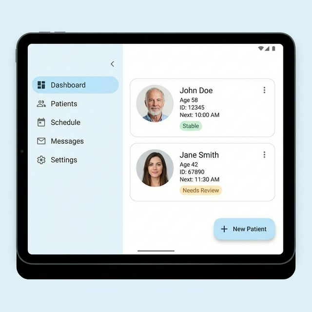
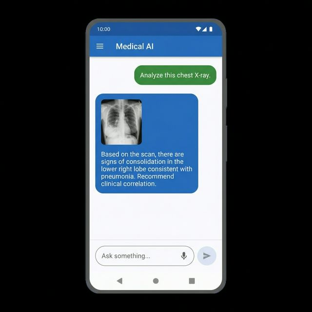
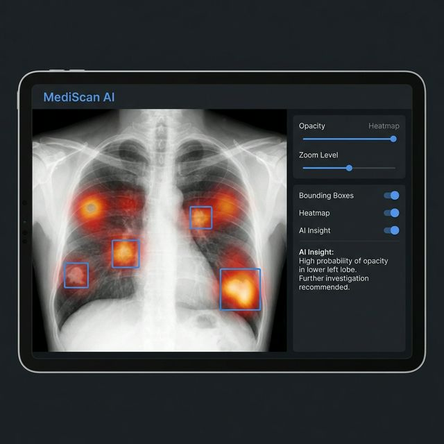

# 🏆 Kaggle Google MedGemma Challenge Submission

**MedVed** locally processes patient files alongside the 4B multimodal weights, avoiding any egress of PHI to third-party endpoints. Built for the **Kaggle Google MedGemma Challenge**, it leverages the lightweight yet powerful **MedGemma 1.5 4B Multimodal** model to process medical inquiries and analyze X-rays directly on Android devices—ensuring 100% data privacy with zero cloud egress.

---

# 📖 Overview

In the fast-paced medical environment, retrieving patient history and analyzing diagnostic images quickly is critical. Cloud-based solutions often raise privacy concerns and latency issues.

**MedVed** solves this by running a specialized medical LLM locally. It allows doctors to:
- **Chat with Patient Records**: Ask natural language questions about a patient's history.
- **Analyze X-Rays**: Upload and discuss medical imagery for preliminary insights.
- **Maintain Privacy**: All data stays on the device, compliant with strict healthcare privacy standards.

# ✨ Key Features

-   **🤖 On-Device Intelligence**: Powered by **MedGemma 1.5 4B Multimodal** via our custom `llama.cpp` backend, offering low-latency responses without internet.
-   **👁️ Multimodal Capabilities**: Seamlessly integrates text and image inputs via the integrated medically-tuned SigLIP vision encoder. Show an X-ray and ask for an analysis.
-   **🔒 Privacy First**: Complete local execution ensures patient data never leaves the tablet/phone.
-   **📂 Longitudinal Patient Records**: Securely store and retrieve patient profiles and history using a local Room Database.
-   **⚡ Optimized Performance**: Built with Android Jetpack Compose and hardware-accelerated llama.cpp inference.

# 🛠️ Technology Stack

-   **Model**: MedGemma 1.5 4B Multimodal (Q4_K_M GGUF from `unsloth/medgemma-1.5-4b-it-GGUF`)
-   **Inference Engine**: Custom `llama.cpp` backend (`com.arm.aichat`) with multimodal support
-   **Android Architecture**: Modern Android Development (MAD)
    -   **Language**: Kotlin
    -   **UI**: Jetpack Compose
    -   **Database**: Room
    -   **Image Loading**: Coil
    -   **Camera**: CameraX

# 🚀 Getting Started

## Prerequisites

-   **Hardware**: Physical Android device (SDK 24+) with developer mode enabled (Tested on Qualcomm Innovator Development Kit with Snapdragon 8 Elite Gen 5 / Pixel 7 Pro).
-   **Software**: [Android Studio](https://developer.android.com/studio) (Hedgehog or newer).

## Installation

1.  **Clone the Repository**
    ```bash
    git clone https://github.com/Start_Antigravity/MediPro-Chronicler.git
    cd MedVed
    ```

2.  **Open in Android Studio**
    -   Select **File > Open** and navigate to the project directory.
    -   Allow Gradle to sync. Ensure NDK is installed for the `llama.cpp` wrapper.

3.  **Build the Project**
    -   Go to **Build > Make Project**.
    -   Connect your Android device via USB.
    -   Select **Run > Run 'app'**.

## Local Model Deployment (`llama.cpp` backend)

This project has migrated away from standard MediaPipe to a highly optimized custom `llama.cpp` wrapper (`com.arm.aichat`) capable of running Q4_K_M GGUF models directly on Android. Upon first launch:

1.  The app will prompt you to download the **MedGemma 1.5 4B Multimodal** (`.gguf`) model from Hugging Face.
2.  Log in with your provided Hugging Face account tokens if required.
3.  The compressed model (~2.8GB) will download directly to the device storage via background services.

### Model Conversion & Fine-Tuning (QLoRA)
If you wish to replicate our specific formatting (SOAP structure), vernacular translation capabilities, and model conversion:
-   Our exact training scripts and synthetic teacher-model datasets are located in the `fine_tuning/` directory.
-   Our fine-tuning pipeline utilizes **QLoRA** with a rank ($r$) of 32 applied to the attention matrices (`q_proj`, `v_proj`).
-   Compute precision must be set to `torch.float32`.
-   To package the fine-tuned model for the Android edge, use the provided official `convert_hf_to_gguf.py` script (located in the `fine_tuning/` directory) to transition the Hugging Face `.safetensors` into the required `Q4_K_M` `.gguf` format.

All code and methodologies provided are rigorously tested and validated per our final submission parameters. Licensed under **CC BY 4.0**.

# 📱 Usage Guide

## 1. Patient Dashboard
View your list of patients. Add new profiles or select an existing one to view their innovative "longitudinal chat" interface.



## 2. Multimodal Chat
Enter symptoms or upload an X-ray image.
> **User**: "Analyze this chest X-ray for signs of pneumonia."
> **MedGemma**: "Based on the image opacity in the lower lobes..."



## 3. X-Ray Analysis Tool
Use the dedicated X-ray tool to highlight specific regions of interest before sending them to the model.



# 📄 License & Acknowledgments

-   **MedGemma**: Copyright Google DeepMind.
-   **llama.cpp**: MIT License.
-   This project is a submission for the **Kaggle Google MedGemma Challenge**.
