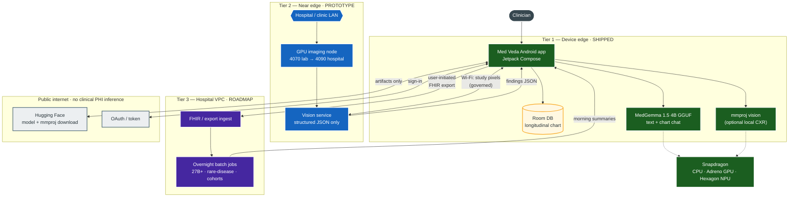
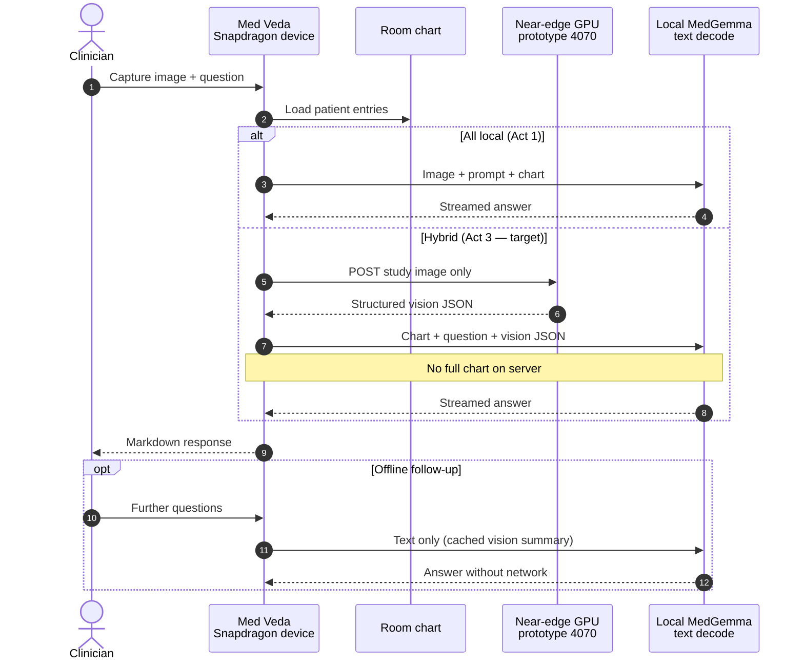
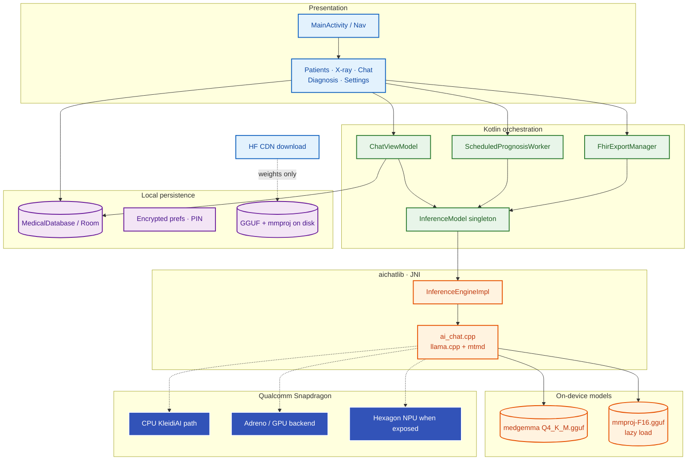
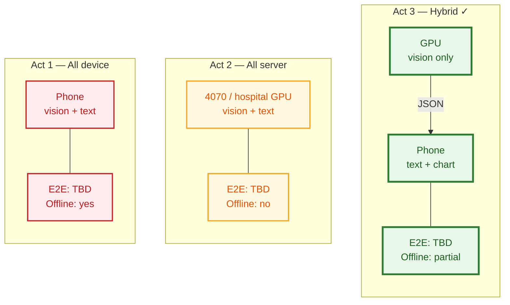
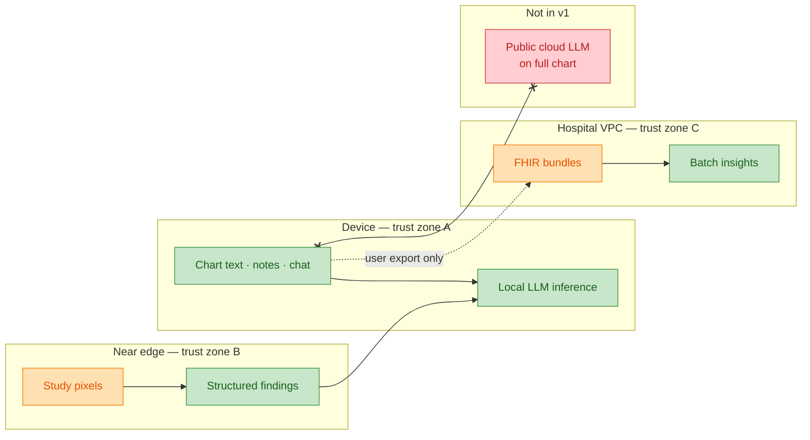
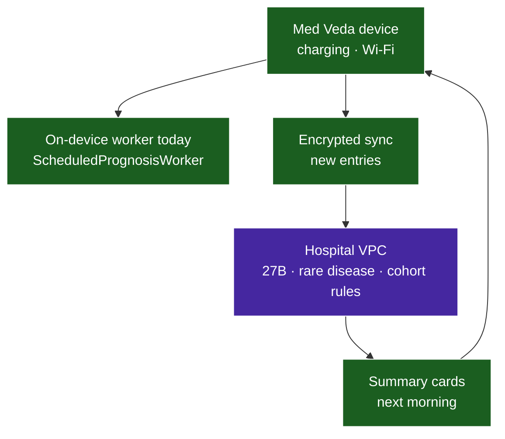

# Med Veda — architecture diagrams (SparQ / Pervasive AI)

Use these in slides, proposals, and live demos. **Diagram 1** is the hero slide for Qualcomm (edge–cloud continuum). **Diagram 2** is the hybrid request path. **Diagram 3** is what ships on-device today (technically accurate).

**Export PNGs:** from repo root, with network:

```bash
py ppt2\diagrams\generate_images.py
# or: .venv\Scripts\python ppt2\diagrams\generate_images.py
```

PNGs land in `ppt2/diagrams/png/` (`diagram_1.png` … `diagram_6.png`).

---

## Diagram 1 — Pervasive AI continuum (hero)

*Three tiers + public internet for models only. Chart narrative stays on device.*



**Say on slide:** Tier 1 is the pervasive copilot (always with the clinician). Tier 2 accelerates heavy imaging. Tier 3 scales history and batch analytics. HF/Auth never see chart Q&A prompts.

---

## Diagram 2 — Hybrid vision workflow (recommended path)

*Chart text never leaves the phone in hybrid mode.*



---

## Diagram 3 — On-device stack (shipped, accurate)

*Single inference path: `aichatlib` + llama.cpp + mtmd — not LiteRT in the app.*



---

## Diagram 4 — Three deployment modes (benchmark story)

*Numbers on slide: `[TBD]` until measured.*



---

## Diagram 5 — Trust boundaries & data types



---

## Diagram 6 — Night batch tier (roadmap)



---

## Slide mapping

| Slide in `ppt2.md` | Use diagram |
|--------------------|-------------|
| Slide 4 — Three tiers | **Diagram 1** |
| Slide 9 — Hybrid pipeline | **Diagram 2** |
| Slide 8 — Shipped stack | **Diagram 3** |
| Slide 7 — Benchmark | **Diagram 4** |
| Slide 11 — Privacy | **Diagram 5** |
| Slide 10 — Night batch | **Diagram 6** |

---

## Legacy note

The old `diagram/system_architecture.md` showed LiteRT/TFLite as the app vision path and referenced `VernacularEngine` — **not accurate** for the shipping app. Use this folder instead.
